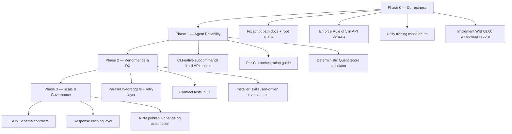

# TradingSquad AI — Improvement Roadmap

> **Purpose:** Living reference for improvements identified during the project audit (July 2026).  
> **Status:** Phase 0 ✅ · Phase 1 ✅ · Phase 2 ✅ · Phase 3 ✅ — **roadmap audit finalized 2026-07-01**  
> **Last updated:** 2026-07-01

This document records what was planned, what shipped, and what remains optional/future work. All four implementation phases are complete; see **Audit Verification** below for evidence paths.

---

## Executive Summary

**Audit result (2026-07-01):** All roadmap items across Phases 0–3 are implemented and verified, except explicitly deferred future work (OS keychain, automated JS/Python API parity in CI).

The framework now has:
- Correct paths, trading modes, Rule of 5, and WIB windowing enforced in **code**
- CLI-native API scripts with `--help` (no `node -e` in SKILL.md files)
- Portable orchestration (`ORCHESTRATION.md`) for Grok, Claude, Codex, Antigravity
- Deterministic Quant Score 360° (20/20/20/40) via `core/quant-score`
- Parallel livedraggers, HTTP retry/cache, hardened installer, contract test suite + CI
- JSON Schema contracts, enriched `skills.json`, publish-ready `package.json`, security hygiene

**Deferred (not blocking):**
1. Automated JS/Python API parity tests in CI (`tests/parity/` — manual only today)
2. OS keychain storage for BYOT tokens on global installs

---

## Phase Overview

| Phase | Theme | Goal |
|-------|-------|------|
| **0** | Correctness | Fix broken paths, mode mismatches, and WIB windowing |
| **1** | Agent Reliability | Make agents succeed on Grok, Claude, Codex, Antigravity equally |
| **2** | Performance & DX | Faster scans, simpler script invocation, better installer |
| **3** | Scale & Governance | Schemas, caching, CI, publish pipeline |



---

## Phase 0 — Correctness

*Fix silent failures and data integrity issues before adding features.*

### 0.1 Script path inconsistencies ✅

| Item | Status | Detail |
|------|--------|--------|
| `AGENTS.md` references `scripts/trading-day-check.js` | ✅ | Root shims resolve cloned + installed layouts |
| `market-scanner/SKILL.md` uses `node scripts/scanner-api.js` | ✅ | Documented shim paths + install deploys shims |
| Root shim scripts | ✅ | `scripts/trading-day-check.*`, `scripts/scanner-api.*`, `_resolve-skill-script.js` |

**Acceptance criteria:**
- [x] Every path referenced in `AGENTS.md` and `SKILL.md` files resolves on both **cloned repo** and **post-install** layouts.
- [x] `node scripts/trading-day-check.js` works from project root after install.

---

### 0.2 Enforce Rule of 5 in API layer ✅

| Item | Status | Detail |
|------|--------|--------|
| `ARCHITECTURE.md` claims `limit=5` is hardcoded | ✅ | Defaults enforced via `core/rule-of-five.js` |
| `scanner-api` tape/detector limits | ✅ | Lists trimmed to 5; `tape` documented as exception |
| Post-processing trim helper | ✅ | `trimToRuleOfFive()` / `clampLimit()` in core |

**Acceptance criteria:**
- [x] `getBrokerSummary()` and `getForeignFlow()` default to `limit=5`.
- [x] SKILL.md examples no longer require agents to remember passing `5` manually.
- [x] Exceptions (e.g. tape reading) are explicitly documented as Rule-of-5 overrides.

---

### 0.3 Unify trading mode enum ✅

| Source | Modes |
|--------|-------|
| `core/trading-modes.json` | Canonical source of truth |
| `AGENTS.md` / `USER_GUIDE.md` | Reference `trading-modes.json` |
| `technical-analyst/SKILL.md` | All 4 modes documented |

**Action:** Create `core/trading-modes.json` (or `TRADING_MODES.md`) as single source of truth. Update `AGENTS.md`, `USER_GUIDE.md`, and all `SKILL.md` files to reference it.

**Acceptance criteria:**
- [x] Short Swing (1–3 weeks) maps to `short_swing`, not `swing`.
- [x] All four API modes are documented with example prompts and broker-summary periods.

---

### 0.4 WIB intraday windowing (09:00 rule) ✅

`AGENTS.md` Rule 3 requires VWAP and intraday High/Low from **09:00 WIB**. `technical-api.js` filters by UTC `todayStr`; `scanner-api.js` already uses WIB offset.

**Action:** Extract shared utilities:
- `core/wib.js`
- `core/wib.py`

Functions: `getWIBNow()`, `getWIBDateString()`, `filterFromMarketOpen(candles)` (09:00–16:00 WIB).

**Acceptance criteria:**
- [x] Intraday VWAP uses candles from 09:00 WIB of the current trading day only.
- [x] Momentum indicators (MA, RSI) still warm up with multi-day history.
- [x] Both JS and Python implementations match.

---

## Phase 1 — Agent Reliability

*Make the skill set work equally well on Grok, Claude, Codex, and Antigravity.*

### 1.1 CLI-native subcommands ✅

All API scripts expose `--help` and CLI subcommands. No `node -e` in SKILL.md files.

**Invocation pattern:**
```bash
node skills/institutional-analyst/scripts/institutional-api.js broker BBCA
node skills/technical-analyst/scripts/technical-api.js BBCA short_swing
node scripts/scanner-api.js livedraggers giants
```

**Acceptance criteria:**
- [x] No `SKILL.md` recommends `node -e "..."` for primary workflows.
- [x] Each script has `--help` documenting subcommands and args.

---

### 1.2 Portable orchestration (per-CLI delegation) ✅

Docs assume Antigravity's `invoke_subagent` tool. Grok, Claude Code, and Codex do not expose this uniformly.

**Action:** Add `ORCHESTRATION.md` (or extend `INSTALLATION.md`) with CLI-specific patterns:

| CLI | Delegation pattern |
|-----|-------------------|
| Antigravity | `invoke_subagent` |
| Grok | Read sub-skill `SKILL.md` + run terminal scripts sequentially |
| Claude Code | Slash commands / explicit skill reads + script chain |
| Codex | `AGENTS.md` workflow with explicit script invocation |

**Acceptance criteria:**
- [x] `institutional-analyst/SKILL.md` references orchestration doc instead of assuming one tool.
- [x] `ORCHESTRATION.md` documents Grok, Claude, Codex, Antigravity patterns with sample prompt.

---

### 1.3 Deterministic Quant Score 2.0 ✅

Originally scoring was prompt-only; README once described an outdated 50/20/30 split. **Shipped:** `core/quant-score.js` / `core/quant_score.py` with the canonical **20/20/20/40** four-engine model (`core/quant-score-spec.json`).

**Acceptance criteria:**
- [x] Same inputs always produce the same score (`core/quant-score.js` / `quant_score.py`).
- [x] `institutional-analyst/SKILL.md` uses `scripts/quant-score.js` — does not invent the number.
- [x] README and spec aligned to 20/20/20/40 ratings (STRONG BUY … STRONG SELL).

---

### 1.4 Clean up `.env.example` ✅

BYOT (`credentialStorage` → `.stockbit_token.json`) is the real auth path. `STOCKBIT_PASSWORD` and `STOCKBIT_PIN` in `.env.example` are unused and misleading.

**Action:** Keep only `STOCKBIT_USERNAME` (optional fallback for profile fetch).

---

## Phase 2 — Performance & Developer Experience ✅

### 2.1 Parallel `livedraggers` with concurrency cap ✅

| Item | Status | Detail |
|------|--------|--------|
| `core/concurrency.js` / `concurrency.py` | ✅ | `mapPool()` / `map_pool()` bounded worker pool |
| `scanner-api.js` `getLiveDraggers()` | ✅ | Parallel fetch, concurrency cap 4 |
| `scanner-api.py` `get_live_draggers()` | ✅ | Same pattern via `map_pool` |

**Acceptance criteria:**
- [x] JS and Python livedraggers use concurrency limit (4).
- [x] HTTP 429 retries handled in `StockbitClient` layer (2.2).

---

### 2.2 API resilience in `StockbitClient` ✅

| Item | Status | Detail |
|------|--------|--------|
| `_fetchWithRetry()` (JS) | ✅ | Exponential backoff, 429/5xx retry (3 attempts) |
| `_request_with_retry()` (Python) | ✅ | Parity with JS |
| GET response cache (30s TTL) | ✅ | Idempotent reads within one agent turn |

**Acceptance criteria:**
- [x] Retry with backoff on 429 and 5xx.
- [x] Short TTL cache for GET requests.

---

### 2.3 Installer hardening (`scripts/install-skills.js`) ✅

| Gap | Status | Detail |
|-----|--------|--------|
| Hardcoded `master` tarball URL | ✅ | `--tag` + `package.json` version via `resolveTarballUrl()` |
| `analysts[]` array duplicated | ✅ | `loadSkillIds()` from `skills.json` |
| `skills.json` only for Antigravity | ✅ | Copied for Claude, Codex, Grok, Other |
| Codex/Grok `file://` paths | ✅ | `.codex/skills/...` and `.grok/skills/...` |
| No post-install verify | ✅ | `--verify`: trading-day-check + auth smoke |
| No version stamp | ✅ | `.tradingsquad-version` + `--check-updates` |

**Acceptance criteria:**
- [x] `node scripts/install-skills.js --help` documents `--tag`, `--verify`, `--check-updates`.
- [x] Local install writes `.tradingsquad-version`.

---

### 2.4 JS/Python parity tests ✅ (minimum suite)

| Item | Status | Detail |
|------|--------|--------|
| `tests/trading-day-check.test.js` | ✅ | Weekday, weekend, holiday exit codes |
| `tests/quant-score.test.js` | ✅ | 72 → BUY, rating bands, weights |
| `tests/auth-smoke.test.js` | ✅ | Skips gracefully without token |
| `tests/concurrency.test.js` | ✅ | `mapPool` behavior |
| `npm test` | ✅ | `node --test tests/*.test.js` |
| `tests/parity/` | ⬜ | Optional network parity — `tests/parity/README.md`; **not** in CI (deferred) |

**Acceptance criteria:**
- [x] Core contract tests run without Stockbit token.
- [x] Auth smoke skips when `.stockbit_token.json` absent.

---

### 2.5 Documentation DRY ✅

| Item | Status | Detail |
|------|--------|--------|
| `core/TRADING_MODES.md` | ✅ | Human-readable canonical reference |
| `core/trading-modes.json` | ✅ | Machine-readable source (Phase 0) |
| `AGENTS.md` / `USER_GUIDE.md` | ✅ | Reference TRADING_MODES.md instead of inline tables |

---

## Phase 3 — Scale & Governance ✅

### 3.1 Enrich `skills.json` ✅

| Item | Status | Detail |
|------|--------|--------|
| `id`, `name`, `description` | ✅ | Per-skill metadata in manifest |
| `triggers` | ✅ | Auto-discovery keywords |
| `cli_aliases` | ✅ | `@skill`, `/skill` aliases |
| Installer `loadSkillIds()` | ✅ | Uses `id` with path fallback |

---

### 3.2 JSON Schema contracts ✅

| Schema | Path |
|--------|------|
| Technical analysis | `core/schemas/technical-analysis.schema.json` |
| Broker summary | `core/schemas/broker-summary.schema.json` |
| Quant score output | `core/schemas/quant-score-output.schema.json` |
| Live draggers | `core/schemas/live-draggers.schema.json` |
| Keystats summary | `core/schemas/keystats.schema.json` |

Validators: `core/schema-validate.js`, `core/schema_validate.py` (zero dependencies).

---

### 3.3 Response caching layer ✅

| Item | Status | Detail |
|------|--------|--------|
| In-memory GET cache | ✅ | Phase 2 baseline (30s TTL) |
| `STOCKBIT_CACHE_TTL_MS` | ✅ | Env override; `0` disables cache |
| `clearCache()` / `getCacheStats()` | ✅ | JS + Python `StockbitClient` |

---

### 3.4 Holiday calendar maintenance ✅

| Item | Status | Detail |
|------|--------|--------|
| `scripts/check-holiday-calendar.js` | ✅ | Warns when year has zero entries |
| `npm run check:calendar` | ✅ | Manual / CI invocation |
| `.github/workflows/ci.yml` | ✅ | Runs tests + calendar check on push/PR |

---

### 3.5 NPM publish readiness ✅

| Item | Status | Detail |
|------|--------|--------|
| `package.json` `files` whitelist | ✅ | scripts, skills, core, docs |
| `engines.node >= 18` | ✅ | Already set in Phase 2 |
| `CHANGELOG.md` | ✅ | Keep a Changelog format |
| `scripts/sync-version.js` | ✅ | `npm run check:version` vs git tag |

---

### 3.6 Security hygiene ✅

| Item | Status | Detail |
|------|--------|--------|
| Installer token warning | ✅ | Warns when `.stockbit_token.json` exists; never overwrites |
| `INSTALLATION.md` token section | ✅ | Never commit, rotate on leak |
| OS keychain integration | ⬜ | Future enhancement |

---

## Audit Verification (2026-07-01)

Full codebase audit against this roadmap. Run `npm test` (16 tests) to re-verify contract tests.

| ID | Item | Verified | Evidence |
|----|------|----------|----------|
| 0.1 | Root script shims | ✅ | `scripts/trading-day-check.*`, `scanner-api.*`, `quant-score.*`, `_resolve-skill-script.js` |
| 0.1 | `AGENTS.md` path refs | ✅ | `AGENTS.md` Rule 5 → `scripts/trading-day-check.js` |
| 0.1 | `market-scanner/SKILL.md` paths | ✅ | Documents shim + cloned + installed paths |
| 0.2 | Rule of 5 API defaults | ✅ | `core/rule-of-five.js`, `institutional-api` `limit=RULE_OF_FIVE` |
| 0.2 | Tape exception documented | ✅ | `market-scanner/SKILL.md` tape row |
| 0.2 | `ARCHITECTURE.md` aligned | ✅ | Section 3 references `rule-of-five` core module |
| 0.3 | `trading-modes.json` | ✅ | `core/trading-modes.json` (4 modes incl. `short_swing`) |
| 0.3 | Docs reference modes | ✅ | `AGENTS.md`, `USER_GUIDE.md` → `TRADING_MODES.md` |
| 0.3 | Technical SKILL modes | ✅ | `technical-analyst/SKILL.md` all 4 modes |
| 0.4 | WIB utilities | ✅ | `core/wib.js`, `core/wib.py` |
| 0.4 | VWAP 09:00 window | ✅ | `technical-api.js/py` `filterFromMarketOpen` |
| 1.1 | CLI subcommands + `--help` | ✅ | All 5 `*-api.js` + 5 `*-api.py` |
| 1.1 | No `node -e` in SKILL.md | ✅ | Grep clean across `skills/**/SKILL.md` |
| 1.2 | `ORCHESTRATION.md` | ✅ | Grok, Claude, Codex, Antigravity patterns |
| 1.2 | Institutional SKILL refs | ✅ | `institutional-analyst/SKILL.md` § ORCHESTRATION |
| 1.3 | Quant Score calculator | ✅ | `core/quant-score.js`, `core/quant_score.py`, `scripts/quant-score.*` |
| 1.3 | Institutional uses quant-score | ✅ | `institutional-analyst/SKILL.md` lines 87–88, 138 |
| 1.4 | `.env.example` BYOT-only | ✅ | `STOCKBIT_USERNAME` only; no password/pin |
| 2.1 | Parallel livedraggers | ✅ | `mapPool`/`map_pool` concurrency 4 in both scanner APIs |
| 2.2 | Retry + cache | ✅ | `_fetchWithRetry`, `_request_with_retry`, 30s GET TTL |
| 2.3 | Installer `--tag/--verify/--check-updates` | ✅ | `scripts/install-skills.js --help` |
| 2.3 | `skills.json`-driven install | ✅ | `loadSkillIds()` |
| 2.3 | `.tradingsquad-version` stamp | ✅ | `writeVersionStamp()` on local install |
| 2.4 | Contract test suite | ✅ | `tests/*.test.js` — 16 passing |
| 2.4 | Auth smoke skip w/o token | ✅ | `tests/auth-smoke.test.js` suite `skip` |
| 2.4 | API parity in CI | ⬜ | Deferred — `tests/parity/README.md` only |
| 2.5 | `TRADING_MODES.md` | ✅ | `core/TRADING_MODES.md` |
| 3.1 | Enriched `skills.json` | ✅ | `id`, `name`, `description`, `triggers`, `cli_aliases` |
| 3.2 | JSON Schemas (5) | ✅ | `core/schemas/*.schema.json` |
| 3.2 | Validators | ✅ | `core/schema-validate.js`, `core/schema_validate.py` |
| 3.3 | Cache TTL env + stats | ✅ | `STOCKBIT_CACHE_TTL_MS`, `clearCache()`, `getCacheStats()` |
| 3.4 | Holiday calendar check | ✅ | `scripts/check-holiday-calendar.js`, `npm run check:calendar` |
| 3.4 | GitHub Actions CI | ✅ | `.github/workflows/ci.yml` |
| 3.5 | NPM `files` whitelist | ✅ | `package.json` `files` array |
| 3.5 | `CHANGELOG.md` | ✅ | Root `CHANGELOG.md` |
| 3.5 | Version sync script | ✅ | `scripts/sync-version.js`, `npm run check:version` |
| 3.6 | Installer token warning | ✅ | `warnIfTokenPresent()` in installer |
| 3.6 | Token docs | ✅ | `INSTALLATION.md` Token Security section |
| 3.6 | OS keychain | ⬜ | Future — not implemented |

---

## Future Work (Post-Roadmap)

| Priority | Item | Notes |
|----------|------|-------|
| Medium | Automated JS/Python API parity in CI | Compare same ticker/mode JSON; skip without `.stockbit_token.json` |
| Low | OS keychain for BYOT tokens | Global install credential storage |
| Low | `skills.json` Phase 3.2 enrichment | JSON Schema validation wired into API CLI output (optional `--validate`) |
| Annual | `idx-holidays.json` year rollover | CI warns via `check-holiday-calendar`; manual BEI update ~Sep/Oct |

---

## What's Already Strong (Don't Break)

| Area | Notes |
|------|-------|
| Multi-agent architecture | `institutional-analyst` as orchestrator + specialized sub-skills |
| BYOT auth | Centralized token refresh in `core/` |
| Installer concept | Single entry, local/global, remote tarball fallback |
| Path resolution | `../../../core/` works for repo and installed layouts |
| Domain rules in `AGENTS.md` | EOD illusion, free-float weighting, holiday guard |
| Zero-dependency JS | Native `fetch`, no npm packages |
| Dual runtime | Python + JS for different agent environments |

---

## Suggested PR Order (Historical — All Shipped ✅)

Original incremental delivery sequence (completed locally July 2026):

1. **PR-1:** Root script shims + fix `AGENTS.md` / `SKILL.md` paths
2. **PR-2:** Rule of 5 defaults + `core/wib` utilities
3. **PR-3:** `core/trading-modes.json` + doc sync
4. **PR-4:** CLI subcommands + `--help` on all API scripts
5. **PR-5:** `ORCHESTRATION.md` + update `institutional-analyst/SKILL.md`
6. **PR-6:** `core/quant-score` calculator
7. **PR-7:** Installer improvements (`skills.json`-driven, `--verify`)
8. **PR-8:** Parity tests + CI workflow
9. **PR-9:** Parallel livedraggers + retry layer
10. **PR-10:** Schemas, caching, publish pipeline

---

## Tracking

When an item ships, change ⬜ → ✅ in this file and note the PR or commit in the changelog section below.

### Changelog

| Date | Item | PR / Commit |
|------|------|-------------|
| 2026-07-01 | Roadmap document created | — |
| 2026-07-01 | **Phase 0 complete** — shims, Rule of 5, trading-modes.json, WIB utils | local |
| 2026-07-01 | **Phase 1 complete** — CLI subcommands, ORCHESTRATION.md, quant-score, .env.example | local |
| 2026-07-01 | **Quant Score revised** — 4-engine model 20/20/20/40 + STRONG BUY…STRONG SELL ratings | local |
| 2026-07-01 | **Phase 2 complete** — parallel livedraggers, retry/cache, installer hardening, tests, TRADING_MODES.md | local |
| 2026-07-01 | **Phase 3 complete** — skills.json manifest, JSON schemas, CI, CHANGELOG, security hygiene | local |
| 2026-07-01 | **Roadmap audit finalized** — full verification matrix; ARCHITECTURE.md Rule of 5 aligned | local |
| 2026-07-01 | **Repo cleanup** — `docs/` for user/dev guides; Python shim DRY; removed `ide-dev.md` | local |

---

&copy; Copyright (c) 2026 - MasEDI.Net